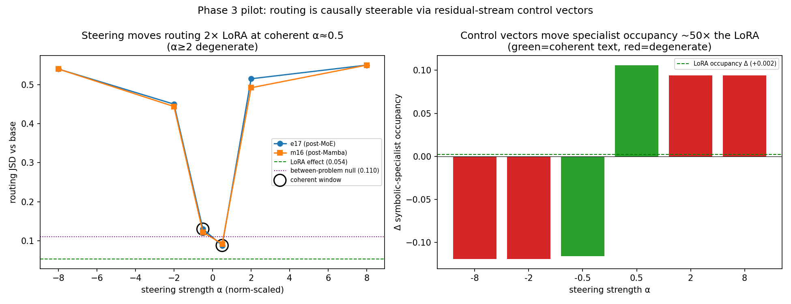

# NemoH — DYFA Report

Expert routing in **Nemotron-3-Nano-30B-A3B**. One **D-Y-F-A** block per
question (Do / Why / Find / Answer), each with a figure. Covers the SPEC's
research questions (Q1a–Q3) and the strongest offline extensions (E1–E4).
Prose detail: `phase1_report.md`, `phase1_extended.md`, `phase3_pilot_gate.md`;
canonical synthesis: `SUMMARY.md`. Two findings carry verification-driven
corrections, flagged inline (Q1c, E2).

*Infrastructure footnote (affects every answer):* all results sit on a
runtime-patched inference stack — the model ships with cached generation broken
in five interacting ways (worst: attention layers never receive the KV cache →
prompt amnesia). Patches validated behaviorally before capture; see
`errors_postmortem.md`.

---

## Q1a — Do experts specialize by problem type?

**D:** Captured top-6 routed experts + weights for every generated token at all
23 MoE layers across 111 problems in six categories, then computed each expert's
*selectivity* (largest share of its routing mass from one category) after
normalizing for unequal category token mass; generation-phase tokens only,
per-problem aggregated routing-mass vector as the unit.

**Y:** Categories contribute wildly unequal mass (symbolic 28% vs creative 5%),
so raw shares would crown every expert "symbolic" by exposure — normalization
makes the 1/6≈0.167 uniform baseline honest; generation-only because batched
prefill rows contain left-pad tokens and we care about routing while the model
*reasons*.

**F:** Median corrected selectivity **0.32 ≈ 2× uniform (0.167)**, inverted-U
over depth (0.23 → **0.37 at L17-20** → 0.27), plus **26 expert-layer pairs at
selectivity > 0.8** (permutation p < 0.002 vs null ~4); routing stays broad
overall (a problem touches 116/128 experts/layer; entropy 4.19/4.85 nats).

**A:** Yes — a **two-tier economy**: a generalist bulk with real-but-soft
category preferences (~2× uniform) plus a thin tier of near-pure specialists,
peaking mid-network. Limitation: ~18-24 problems/category, so we lean on
layer/distribution-level statistics, not individual-expert claims.

---

## Q1b — Does problem difficulty change routing?

**D:** Compared routing entropy, top-1 concentration, and unique-experts-per-
token across difficulty levels within each category, with a pre-registered
check that any "unique experts" effect be tested against generation length
first.

**Y:** Harder problems generate longer CoT and unique-expert counts saturate
near 128, so the per-token ratio *mechanically* falls with length — entropy and
concentration are length-robust and carry the real test; pre-registering the
confound avoids dressing an artifact up as a finding.

**F:** Entropy is flat across difficulty in every category (**≈4.0-4.4 nats at
every level**); concentration barely moves (only hard-factual rises to 0.14);
the unique-experts decline vanishes once length is controlled — exactly the
pre-registered artifact.

**A:** Routing is effectively **blind to difficulty** — the router classifies
*what kind* of input it sees, not *how hard*. Limitation: difficulty axes are
benchmark-defined (GSM8K steps, MATH level), which may not match the model's
internal sense of hardness; ~6-8 problems/cell powers only large effects.

---

## Q1c — Does routing correlate with correctness?

**D:** Point-biserial correlation between per-problem correctness (n=95 scored;
16 truncations excluded; social/ethical unscored) and per-problem routing
metrics averaged across layers, pre-registered stratification by difficulty
*and* category. **Correction (Extended G):** re-tested with a second metric
(per-token, mid-network, thinking-region concentration).

**Y:** Correctness is binary → point-biserial; stratification was
pre-registered because difficulty could drive both dispersion and errors; the
second metric tests *where* any signal lives (global vs local, thinking vs
answer).

**F:** With Phase 1's whole-generation aggregated metric, concentration tracks
correctness — pooled all-scored **r = 0.31, p = 0.005**, and within the
gradable categories **factual+reasoning pooled r = 0.44, p = 0.008**. But the
per-token thinking-region metric gives **r = 0.04 (n.s.)**, and there is **no
think→answer routing shift** (Wilcoxon p = 0.36): the signal is *global*, not a
local moment of commitment.

**A:** A **metric-dependent yes**: concentration correlates with correctness
within gradable categories *when measured globally* (r = 0.44, p = 0.008), but
it is a property of how the whole problem is routed, not a per-token confidence
signal, and the pooled all-category r = 0.31 is partly category composition.
Limitation: per-category n = 16-19 is underpowered; precise within-type strength
is unsettled. (This is a deliberate downgrade from "routing is a confidence
signal" after the second-metric check.)

---

## Q2a — How does the LoRA change routing on its native (symbolic) domain?

**D:** Ran the same 111 problems with the symbolic LoRA applied, built
per-problem per-layer routing distributions for both models, compared
same-problem base↔LoRA via Jensen-Shannon divergence and top-6 Jaccard, scaled
against a within-category between-problem null.

**Y:** JSD over KL because it is symmetric/bounded (the two runs emit different
tokens, neither direction privileged); the null is essential because "JSD=0.05"
is meaningless without knowing how far *unrelated* profiles sit; same-problem
pairing controls for content.

**F:** Symbolic divergence is the largest of six categories (mean JSD **0.0537**;
Mann-Whitney **U=1404, one-sided p < 10⁻⁵, rank-biserial r = 0.68** vs others)
— yet only **half the between-problem null (0.110)**.

**A:** Given p < 10⁻⁵ but a shift half the within-category null, LoRA
**measurably and preferentially re-weighted symbolic routing without relocating
it** — re-ranking within the base model's routing geography. Limitation: the two
models generate different sequences, so content drift and routing drift are
partially confounded; n = 18 symbolic; JSD on renormalized top-6 winner mass.

---

## Q2b — Does the routing shift leak into non-symbolic domains?

**D:** Computed the same divergence metrics per category and compared each to
its *own* between-problem null.

**Y:** Per-category nulls because categories differ in baseline routing
diversity (factual problems are far more routing-distinct from each other, null
0.214, than symbolic, 0.110) — a shared threshold would misread leakage.

**F:** Divergence is **graded by domain adjacency**: factual 0.024 <
social/ethical 0.027 < reasoning 0.040 < creative 0.043 < computational 0.045 <
symbolic 0.054; every category sits well under its null (factual 9× under).

**A:** Leakage exists (no category is routing-identical post-LoRA) but is
**bounded and ordered by similarity to the training domain** — influence is
largely contained to symbolic-adjacent processing. Limitation: "adjacency" is
informal; a token-overlap covariate would make the gradient quantitative.

---

## Q2c — Are Phase 1's specialization patterns preserved?

**D:** Built per-layer category-normalized expert×category matrices for each
model, correlated them (Pearson, flattened), and tracked every base near-pure
specialist (selectivity > 0.8) across models.

**Y:** Pattern correlation captures whether the *map* of who-serves-what
survived independent of per-problem re-rankings (Q2a); specialist tracking tests
the most fragile tier (0.5-1% mass experts could be silently reassigned).

**F:** Mean per-layer pattern correlation **r = 0.927** (min 0.85); **25/25**
base specialists kept their category (0 flips). Accuracy context: symbolic fell
15/15 → 11/13 while routing slightly concentrated — commitment without
competence.

**A:** Given r ≈ 0.93 and complete specialist survival, the specialization
architecture is **preserved**: LoRA re-weights within an intact expert-category
map. Mechanistic basis (`lora_target_modules.md`): the adapter trains
attention/Mamba/shared-expert only — never the router or routed experts — so all
divergence is necessarily indirect. Limitation: specialist selectivities rest on
few problems; minor 25-vs-26 specialist accounting difference between pipelines.

---

## Q3 — Can routing be causally steered via layer-type control vectors? (pilot)

**D:** Extracted symbolic-vs-rest mean-difference vectors at 16 sites (post-Mamba
& post-MoE × 8 depths), injected `h += α·σ·v̂` at α ∈ {±0.5, ±2, ±8} on 6
problems, measured routing JSD vs base and change in symbolic-specialist
occupancy, with a text-coherence check.

**Y:** Mean-difference (not repeng) for a timeboxed pilot; norm-scaled α so
strengths are comparable across sites; the coherence check because a routing
change that destroys fluency is not useful steering; α=0 twice gives an exact
0.0000 noise floor.

**F:** At the **weakest** strength (α=±0.5) routing JSD is **0.088-0.130**
(~2× the LoRA's 0.054, near the 0.110 null) while text stays coherent, and
symbolic-specialist occupancy moves **±0.12** — versus the LoRA's +0.002, a
**~50× lever**. α ≥ 2 is degenerate (loops / off-topic).

**A:** Yes — routing is **causally steerable from the residual stream**, and far
more strongly than fine-tuning moved it, within a usable window of |α| ≤ ~1.
This validates the control-vector premise (the router is frozen, so indirect
residual steering is the right instrument). Limitations: pilot is 6 problems and
single-prompt coherence judgement; the Stage-1 sweep and a causal *accuracy*
test are not yet run (need GPU); mean-logprob is not a coherence metric (loops
score better than reasoning) → use a distinct-n-gram detector next.

---

## E1 — Is the specialization semantic, or just surface features?

**D:** Split symbolic/reasoning/factual into subtypes; measured within- vs
between-subtype routing JSD (mid-network), permutation-tested (2000 shuffles).

**Y:** Directly tests the Q1a limitation — if routing splits by *subtype*
(Roman numerals vs cipher vs bit-ops), it tracks task semantics, not surface
cues like "has digits."

**F:** Within-subtype routing is **3.5× more similar** than between-subtype for
symbolic (0.035 vs 0.124, permutation **p < 0.0005**); all six subtypes form
clean diagonal blocks; effect significant for all three categories.

**A:** Specialization is **semantic and fine-grained** — it distinguishes
sub-tasks, retiring the surface-feature caveat. Limitation: 3 problems/subtype,
so subtype clusters are demonstrated, not finely quantified.

---

## E2 — Is routing a coherent cross-layer pathway?

**D:** Computed normalized mutual information (NMI) between a problem's top-1
expert at adjacent MoE layers, **then ran a permutation null** (shuffle problem
identity between layers, 60-200 draws) to correct for finite-sample bias.

**Y:** With 111 problems and up to 128 distinct top-1 labels, NMI is mechanically
inflated — the raw number is uninterpretable without the null. (Running the null
*before* consolidating was the point.)

**F:** Raw NMI averages **0.71**, but the permutation null floor is **0.60**;
the **bias-corrected excess is only 0.117** (min 0.030 across pairs), positive
for all 22 pairs.

**A (corrected):** There *is* statistically real problem-specific cross-layer
coupling, but it is **weak — not the "coherent pathway" the raw 0.71 implied**.
The firmer companion finding is within-layer expert *teams* (co-activation
modularity Q ≈ 0.20-0.26). Limitation: top-1-only summary discards the rest of
the top-6; a soft-assignment version could detect coupling the top-1 misses.

---

## E3 — Are experts organized into category "teams," and which is sharpest?

**D:** Greedy-modularity community detection on the within-layer co-activation
graph (layers 8/17/24/38), each community scored by category **enrichment** =
(team's share of a category's mass) ÷ (corpus base rate).

**Y:** Enrichment, not raw share, because symbolic is 28% of tokens and would
dominate every team by exposure; modularity gives data-driven team boundaries
rather than imposed ones.

**F:** Communities are real (modularity Q ≈ 0.20-0.26). **Social/ethical has the
most distinctly organized team — 3.25× enriched at L17** (also 2.5× L24, 2.3×
L38); factual gets small sharply-enriched teams late (2-2.7× at L38); symbolic
spreads across many mildly-enriched subtype clusters (~1.4×).

**A:** The generalist bulk is itself organized into **category-leaning teams**,
sharpest for social/ethical (striking, since that category was unscorable) and
late-layer factual. Limitation: community membership boundaries are unstable
where routing is diffuse (late layers); we trust frozen-set enrichment over
membership Jaccard.

---

## E4 — Does the load-balancing bias work, and where does the model differentiate most?

**D:** From corpus-aggregate per-layer routing mass, computed Gini, dead-expert
count, and #experts carrying 50% of mass, per layer, base vs LoRA.

**Y:** The architecture's `e_score_correction_bias` is *designed* to prevent
expert collapse — Gini/dead-count test whether it works on real traffic; the
base-vs-LoRA contrast shows fine-tuning's effect on balance.

**F:** **Zero dead experts** in any of 23 layers (anti-collapse works), yet
utilization is non-uniform (~40/128 carry 50% of mass; mean Gini 0.28). Gini
**peaks at layer 17** (0.43) — the same layer that has peak selectivity (Q1a),
the sharpest social team (E3), and the pure specialists (L17 atlas): **four
independent signals name L17 the nexus.** LoRA concentrates load slightly
everywhere (Gini 0.28 → 0.32) without creating dead experts.

**A:** Load balancing is **effective but not flattening** — no collapse, yet
enough freedom for genuine specialization, concentrated at **layer 17**.
Indirect fine-tuning nudges the whole system toward concentration without
breaking the balance. Limitation: corpus-aggregate masses, so this is
population-level balance, not per-prompt.

---

*Reproduce:* `build_dataset.py` → `capture_routing.py` (applies patches) →
`analyze_routing.py`; offline analyses via `extended_analysis.py`,
`subtype_lora_compare.py`, `coactivation_communities.py`, `social_team_lora.py`,
`thinking_vs_answer.py`, `load_balancing.py`, `l17_atlas.py`, `nmi_null.py`,
`divergence_analysis.py`, `phase3_*`. Seeds/configs in each `run_config.json`.
