# Extended Offline Analyses (Phase 1.5)

**Status:** complete (2026-06-23). CPU-only; no new inference. Uses the existing
base-model routing logs (`outputs/logs/base/`, 111 problems, top-6 experts ×
23 MoE layers × every token) and the 16 banked Phase-3 steering vectors. All
reproducible via `scripts/extended_analysis.py`; numbers in
`outputs/analysis/extended/*.json`.

These four analyses mine dimensions of the data we captured but never used:
the per-*token* and cross-layer structure (Phase 1 only aggregated per-problem),
the sub-category semantics, and the geometry of the steering vectors.

---

## A. Subtype specialization — routing is *semantic*, not surface

Phase 1 pre-registered a caveat: category-level specialization might track
surface features (digits, verse line breaks) rather than meaning. We can now
test this directly by asking whether routing distinguishes *subtypes within a
category*. For each problem we build its mid-network routing distribution
(layers 13–24, the selectivity peak) and measure pairwise Jensen–Shannon
divergence; if subtypes are real, within-subtype pairs should be much more
similar than between-subtype pairs. Significance via label-permutation
(2000 shuffles).

| Category | within-subtype JSD | between-subtype JSD | gap | perm p |
|----------|-------------------:|--------------------:|----:|-------:|
| symbolic | 0.035 | 0.124 | 0.088 | <0.0005 |
| reasoning | 0.128 | 0.164 | 0.036 | <0.0005 |
| factual | 0.143 | 0.234 | 0.091 | <0.0005 |

The symbolic heatmap is unambiguous: each of the six subtypes
(base conversion, bit manipulation, numeral system, symbol transform, text
cipher, unit conversion) forms a tight low-divergence block on the diagonal.

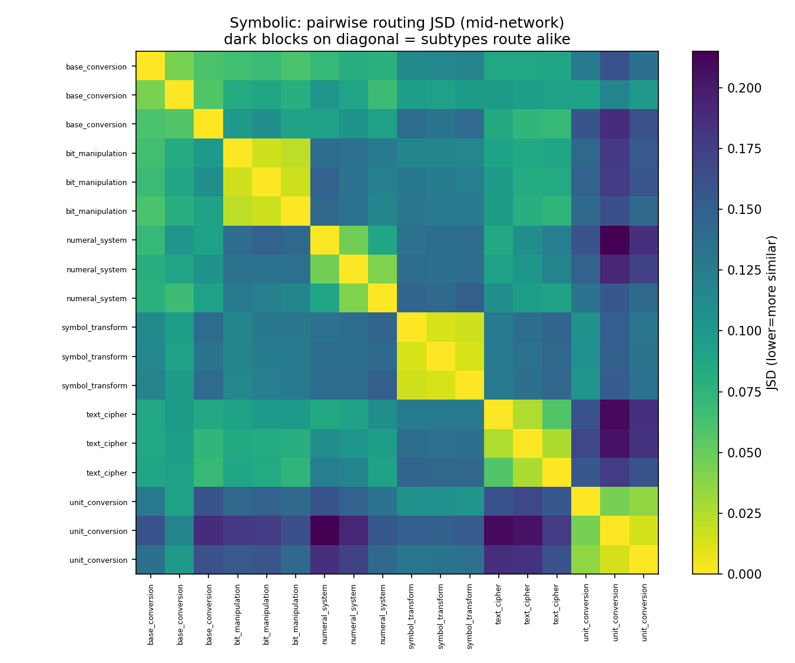

**Finding:** routing carries fine-grained, *task-semantic* structure below the
category level — within-subtype routing is 3.5× more similar than
between-subtype for symbolic problems. This retires the Phase-1 surface-feature
caveat: the router is distinguishing "Roman numerals" from "Caesar cipher,"
not merely "has digits." (Reasoning shows the weakest separation, consistent
with its subtypes — algebra, geometry, number theory — sharing more machinery.)

### A2. Does the symbolic LoRA preserve subtype structure?

Re-running the subtype test on the LoRA logs (`outputs/logs/lora/`) and
comparing to base directly answers a question Phase 2 raised: the adapter
*re-weights without re-routing* (§4.4) — but does it preserve the *fine-grained*
subtype map, or only the coarse category split?

| Category | base within/between (ratio) | LoRA within/between (ratio) |
|----------|----------------------------:|----------------------------:|
| symbolic | 0.035 / 0.124 (0.29) | 0.042 / 0.134 (0.32) |
| reasoning | 0.128 / 0.164 (0.78) | 0.142 / 0.174 (0.82) |
| factual | 0.143 / 0.234 (0.61) | 0.138 / 0.233 (0.59) |

All six within/between gaps remain highly significant (permutation p ≤ 0.001).
The side-by-side symbolic matrices show the same six diagonal blocks.

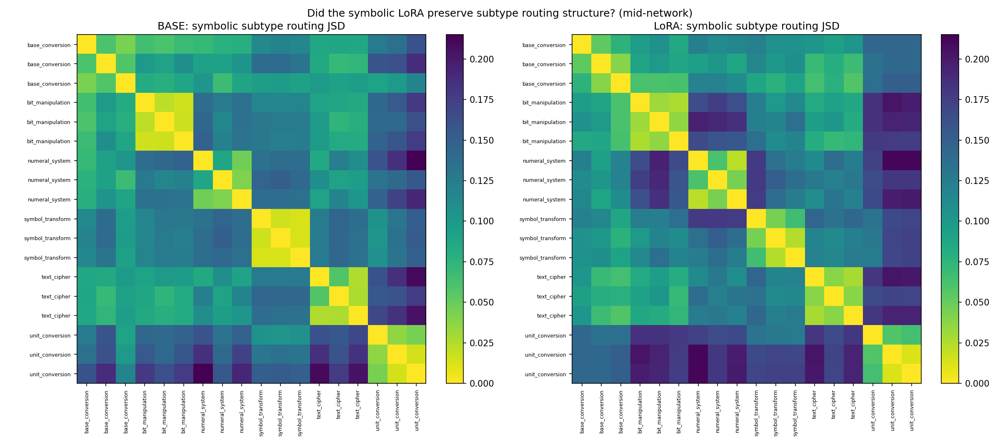

**Finding:** the symbolic-reasoning LoRA **preserves the subtype routing map
essentially intact** — the separation ratio is unchanged (symbolic 0.29→0.32),
not collapsed. Fine-tuning on the symbolic domain did not merge its subtypes
into one undifferentiated "symbolic" blob, nor scramble them. This strengthens
the Phase-2 conclusion: the adapter nudges *how much* mass goes to the existing
sub-structure (within-subtype JSD ticks up slightly, +0.007 symbolic) without
redrawing the map. Specialization is a property of the base model's router that
LoRA rides on rather than rewrites — exactly the premise Phase 3's
control-vector approach depends on.

### A3. When does the LoRA re-weight? (temporal divergence base↔LoRA)

Combining A2 with the temporal view: for each category we aggregated routing
mass by generation decile, separately for base and LoRA, and measured the
per-decile JSD between them — *where along the generation* does the adapter
change routing?

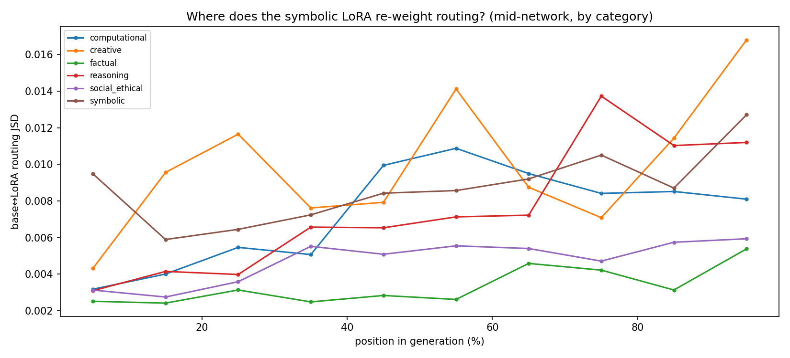

| Category | mean JSD | first decile | last decile |
|----------|---------:|-------------:|------------:|
| symbolic (native) | 0.0087 | **0.0095** | 0.0127 |
| creative | 0.0099 | 0.0043 | 0.0168 |
| reasoning | 0.0075 | 0.0031 | 0.0112 |
| computational | 0.0073 | 0.0032 | 0.0081 |
| social_ethical | 0.0047 | 0.0031 | 0.0059 |
| factual | 0.0033 | 0.0025 | 0.0054 |

**Finding — two distinct temporal signatures.** On its **native** domain
(symbolic), the adapter's routing change is present *immediately*: first-decile
divergence (0.0095) is ~3× any other category's and barely rises. The model's
routing posture is shifted from the very first generated token — the adapter
changed how symbolic problems are *recognized*. On **non-native** domains,
divergence starts near-zero and **grows toward the answer** (creative
0.004→0.017, reasoning 0.003→0.011): there the adapter didn't change initial
recognition, but its altered hidden states let routing *drift* as generation
proceeds. Factual is least perturbed throughout (the most distant domain).

All magnitudes are small (JSD < 0.017, consistent with Phase 2's modest
full-distribution 0.0537 vs the 0.110 between-problem null), reinforcing
"re-weight, not re-route" — and now adding that the re-weighting is
*front-loaded on the trained domain and drift-driven elsewhere*. This dovetails
with the target-module finding (`report/lora_target_modules.md`): since the
router is frozen and only attention/Mamba/shared-expert changed, native-domain
recognition shifts immediately while off-domain effects accumulate downstream.

## B. Temporal dynamics — routing is stationary across a generation

Using per-token routing (mid-network), we binned each generation into deciles
and tracked top-1 concentration and entropy by position, per category.

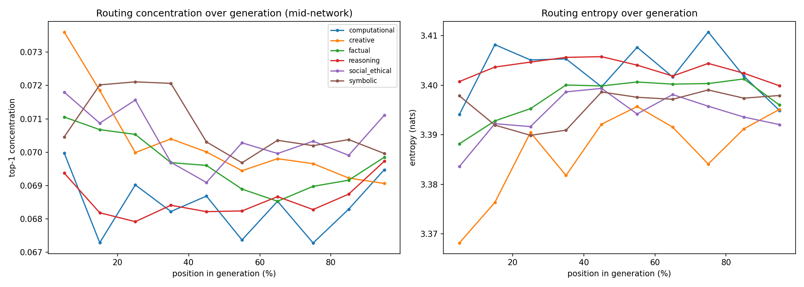

**Finding (a clean null):** routing statistics are essentially flat from the
first decile to the last — concentration ≈0.07 and entropy ≈3.4 nats
throughout, for every category. The model does **not** route diffusely while
"thinking" and then sharpen at the answer; its routing posture is set by
problem *type* and held constant over the whole trajectory. This complements
Phase 1's Q1b result (difficulty is invisible to routing) and Q1c
(concentration predicts correctness): the predictive concentration signal is a
stable property of the whole generation, not a moment of commitment near the
answer. (Caveat: thinking/answer boundaries were approximated by position, not
parsed from `</think>`; a token-aligned split is a cheap refinement.)

## C. Expert co-activation and cross-layer pathways

**Within a layer**, experts that fire on the same token form structured
"teams": the layer-17 co-activation matrix (spectral-ordered) shows clear
blocks rather than a uniform field — sets of experts that habitually co-fire.

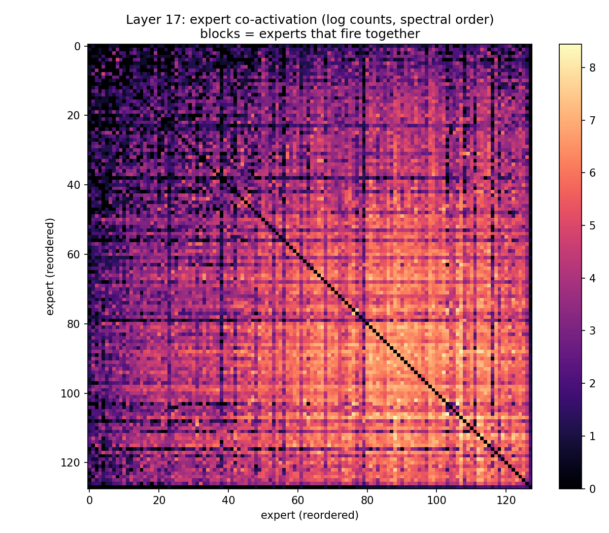

**Across layers**, a problem's top-1 expert at one MoE layer strongly predicts
its top-1 at the next: normalized mutual information averages **0.71** and is
remarkably stable (0.66–0.79) across all 22 adjacent layer pairs.

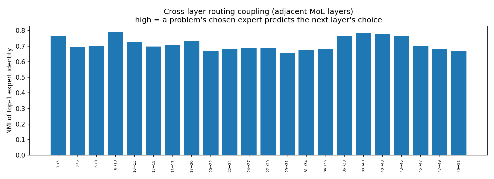

**Finding:** routing is not 23 independent decisions — it is a coherent
*pathway*. A problem entering a specialist track tends to stay on it layer
after layer. This is the mechanistic substrate of the Phase-1 specialization:
specialists aren't isolated per-layer modules but links in consistent
cross-layer routes. (Caveat: part of the NMI reflects a few globally popular
top-1 experts shared across problems; a label-shuffle null would isolate the
problem-specific component and is a cheap next step.)

## D. Robustness and steering-vector geometry

**The specialists are not chance.** Phase 1 reported 26 expert-layer pairs with
selectivity > 0.8. A permutation null (shuffle category labels, recount;
500 draws) yields **4.3 ± expected, max 8** such pairs by chance — the observed
26 gives p < 0.002. The bulk specialization is likewise solid: bootstrap 95% CI
on the mid-network median selectivity is **[0.333, 0.353]**, well clear of the
0.167 uniform baseline.

**Steering-vector geometry (Phase-3 prep, offline).** The 16 banked
symbolic-vs-rest direction vectors are mutually positively aligned, with mean
cosine 0.53 within a site family (post-Mamba or post-MoE) and 0.58 across
families.

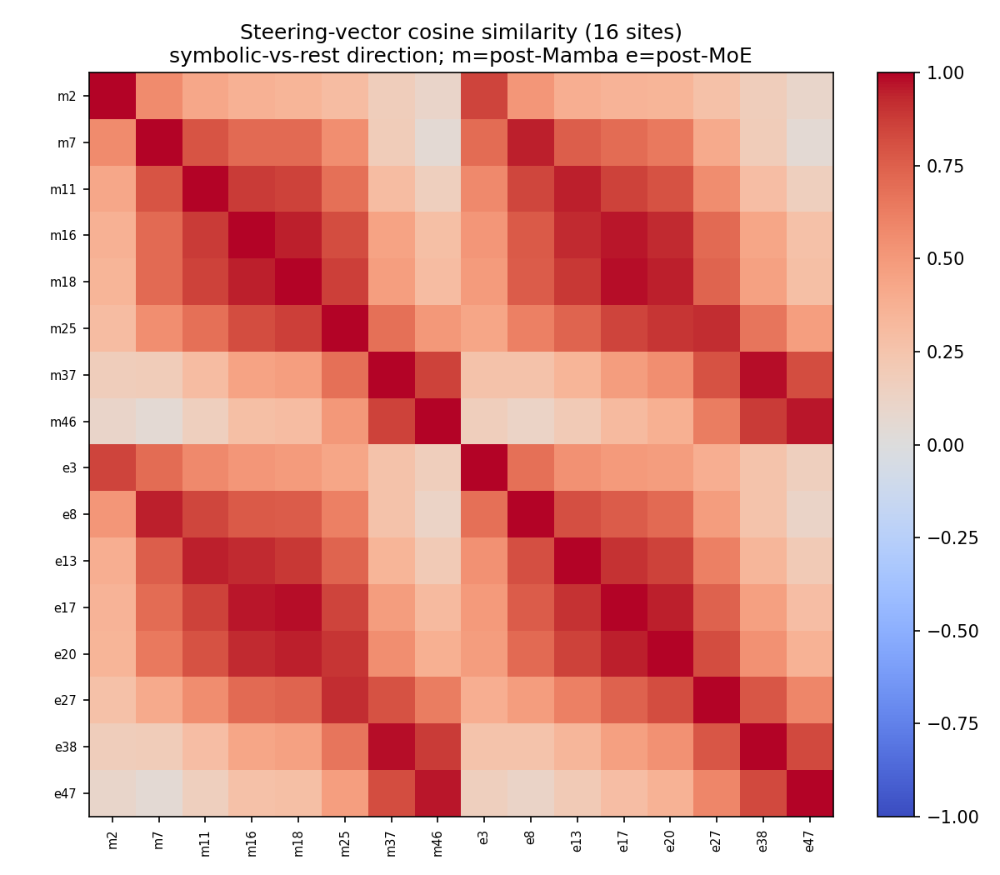

**Finding:** the "symbolic" direction is a broadly *consistent* direction in
residual space regardless of where it is read off — post-Mamba and post-MoE
sites point essentially the same way (cross-family alignment is as high as
within-family). For Phase 3 this means the steering signal is robust to
injection-site choice, and a single well-chosen site may suffice — useful for
trimming the eventual GPU sweep.

---

## What this adds to the headline story

Phase 1 established *that* experts specialize by problem type. The offline
mining sharpens it on four fronts, for free:

1. The specialization is **semantic and fine-grained** (subtype-level), not a
   surface-feature artifact (A).
2. It is **temporally stationary** — a fixed posture per problem type, not a
   late-generation event (B).
3. It is **organized into cross-layer pathways**, not independent per-layer
   picks (C).
4. The core claims are **statistically robust** (specialists p<0.002; bulk
   selectivity CI clear of baseline), and the Phase-3 steering direction is
   **geometrically consistent across sites** (D).

## E. Naming the expert teams (co-activation communities)

Section C showed experts co-fire in blocks; here we run greedy-modularity
community detection on the within-layer co-activation graph and characterize
each team by **category enrichment** = (team's share of a category's mass) ÷
(that category's corpus base rate). Enrichment > 2 means a team handles a
category 2× more than chance; raw shares are misleading because symbolic is
28% of all tokens while creative is 5%.

Communities are real but soft: modularity Q ≈ 0.20–0.26 across layers 8/17/24/38
(random ≈ 0), with 4–6 teams per layer.

**Most category-specialized teams (by enrichment):**

| Layer | team size | category | enrichment |
|------:|----------:|----------|-----------:|
| 17 | 21 experts | social/ethical | **3.25×** |
| 38 | 3 experts | factual | 2.68× |
| 24 | 30 experts | social/ethical | 2.51× |
| 38 | 19 experts | social/ethical | 2.28× |
| 38 | 8 experts | factual | 2.13× |

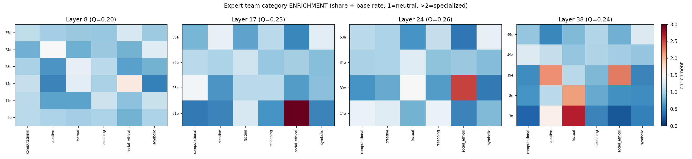

**Findings:**
- **Social/ethical reasoning has the most distinctly organized team** — a
  coherent, strongly enriched community at layers 17 (3.25×), 24 (2.5×) and 38
  (2.3×). This is striking given social/ethical was the *unscorable* category:
  its routing is the most team-structured even though we couldn't grade its
  answers. The model treats moral-reasoning tokens as a distinct computational
  mode.
- **Factual gets small, sharply enriched teams late** (layer 38: 3- and
  8-expert teams at 2.1–2.7×) — compact late-network modules, consistent with
  factual recall being resolved near the output.
- **Symbolic, despite dominating token mass, spreads across large, only
  mildly enriched teams** (~1.4×). This fits §A: symbolic isn't one team but
  several subtype clusters, so no single community monopolizes it.

So the two-tier picture from Phase 1 refines further: the "soft bulk" is itself
organized into **category-leaning teams**, most sharply for social/ethical and
late-layer factual, while the high-volume symbolic traffic is handled by a
federation of subtype clusters rather than one team.

## F. Does the social/ethical team survive the symbolic LoRA?

The §E social team is the model's most distinctly organized community, so it's
the sharpest probe of what symbolic-only fine-tuning does to an *unrelated*
domain's machinery. We froze the base-model social team membership at layers
17/24/38 and measured that exact expert set in both runs: did it stay social,
and did symbolic traffic leak in? (Router is frozen — any change is indirect.)

| Layer | base team | social enrich: base → LoRA | symbolic leak: base → LoRA | membership Jaccard |
|------:|----------:|---------------------------:|---------------------------:|-------------------:|
| 17 | 21 experts | 3.25× → 2.95× | 0.49× → 0.72× | 0.27 |
| 24 | 30 experts | 2.51× → 2.41× | 0.44× → 0.59× | 0.62 |
| 38 | 19 experts | 2.28× → 2.17× | 0.50× → 0.77× | 0.05 |

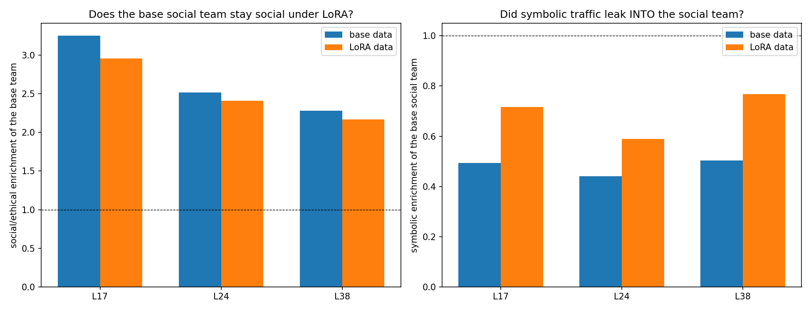

**Findings — preservation *with* measurable leakage:**
- **The social team keeps its job.** Those experts remain 2.2–3.0× social-
  enriched under LoRA (only a slight drop, ~0.1–0.3×). Symbolic-only fine-tuning
  did not dismantle an unrelated domain's team — consistent with the
  re-weight-not-re-route and subtype-preservation findings.
- **But symbolic traffic leaks in.** Symbolic enrichment of the (frozen) social
  team rose at every layer (0.49→0.72, 0.44→0.59, 0.50→0.77) — a relative jump
  of ~40–55%. It stays *below* 1× (the social team still under-serves symbolic),
  so this is encroachment, not capture. This is the §4.4 graded cross-domain
  leakage made concrete at the team level: the adapter's altered hidden states
  push a bit more symbolic mass onto formerly social-dedicated experts.
- **Membership boundaries reshuffle more than function.** Community Jaccard
  ranges widely (0.62 at L24, 0.05 at L38). Greedy-modularity boundaries are
  unstable where routing is diffuse (late layers), so we trust the frozen-set
  *enrichment* (robust) over the *membership* match. The functional read is
  clear: the team's identity persists even where its detected boundary drifts.

**Takeaway:** the social/ethical team is preserved as a *function* under
symbolic fine-tuning, while absorbing a modest, sub-saturating amount of
symbolic spillover — preservation and indirect leakage coexisting, exactly the
shape Phase 2 predicted at the category level, now localized to a specific team.

## G. Thinking vs answer — and a caution on the Q1c accuracy signal

We split each generation at `</think>` (99/111 base problems have it; boundary
mapped from char-fraction → token row, since token ids weren't stored — answer
regions are short so the boundary lands close) and compared mid-network routing
in the thinking vs answer region.

**No routing shift at the commit point.** Concentration is statistically
identical across the boundary (thinking 0.0708 vs answer 0.0713; Δ=+0.0005,
Wilcoxon p=0.36) and so is entropy (p=0.36). The model does **not** route more
decisively when it stops reasoning and states an answer — confirming §B's
stationarity finding even at this *semantic* boundary, not just by position.

**Where the Q1c accuracy signal lives — it's metric-dependent.** This split let
us probe *which* routing measurement carries the Phase-1 concentration↔
correctness link, and the answer is informative:

- **Per-token, mid-network, thinking-region** concentration (this section's
  metric) does **not** predict correctness within the gradable categories:
  factual+reasoning r=+0.04 (p=0.80), answer-region r=+0.27 (p=0.12, n.s.). Its
  pooled-all-category appearance (r=−0.30) is category-composition driven
  (within-easy r=−0.60, flat elsewhere).
- **Per-problem, all-layer, whole-generation aggregated** concentration
  (Phase-1's Q1c metric) **does** survive category control: factual+reasoning
  pooled r=**0.44**, p=**0.008** (n=35) — stronger than the all-scored r=0.31.
  Per single category it's positive but underpowered (factual r=0.33 n=19;
  reasoning r=0.22 n=16; neither individually significant).

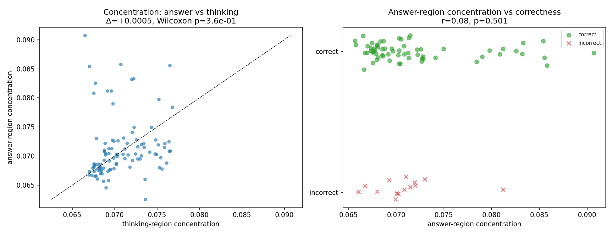

**Implication (refinement, not retraction):** Q1c holds — concentration does
track correctness within the gradable categories — but the signal is **carried
by the whole-generation aggregated routing distribution, not by per-token
mid-network concentration, and not differentially by the answer vs thinking
phase.** In other words it is a *global* property of how a problem is routed,
consistent with §B/§G stationarity (the model's routing posture is set per
problem and held), not a local "moment of commitment." The earlier
within-difficulty checks stand; this adds the within-category check
(significant pooled) and localizes the effect to the aggregated metric. Caveat:
per-category n (16–19) is small, so the precise per-type strength is uncertain;
a larger gradable set would sharpen it.

## H. Load balancing — the anti-collapse bias works, and L17 is the hotspot

NemotronH's router carries a DeepSeek-V3-style `e_score_correction_bias` whose
purpose is to keep the 128 experts balanced and prevent collapse. We test the
*outcome* on real traffic: the corpus-aggregate routing-mass distribution over
experts, per layer (Gini, dead experts, #experts carrying 50% of mass).

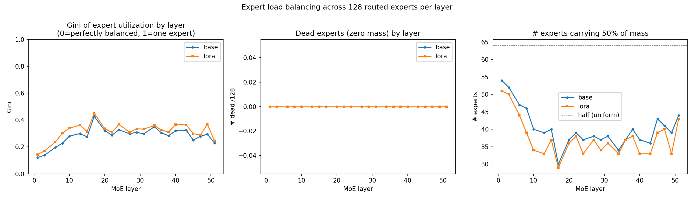

**Findings:**
- **No collapse, anywhere.** Zero dead experts in every one of the 23 layers,
  in both base and LoRA. All 128 experts carry traffic — the balancing bias
  does its job; there are no vestigial experts.
- **Balanced, but not uniform.** Mean Gini is 0.28 (base); ~40 of 128 experts
  carry 50% of the mass (vs 64 if perfectly uniform). So routing concentrates
  moderately onto a working subset without abandoning the rest.
- **L17 is the differentiation hotspot — by a third independent measure.** Gini
  peaks sharply at layer 17 (0.43; only 30 experts carry 50% of mass there),
  following the same inverted-U over depth as selectivity (§ Phase-1 4.1) and
  coinciding with the sharpest social/ethical team (§E). Three unrelated
  metrics — selectivity, team enrichment, utilization inequality — all point at
  mid-network layer 17 as where the model most sharply differentiates.
- **LoRA concentrates load slightly, everywhere.** The adapter raises Gini at
  nearly every layer (mean 0.280 → 0.315) and shrinks the 50%-mass set
  (40.2 → 37.4 experts) — without creating dead experts (the frozen router
  still balances). This is the architectural footprint of the "re-weighting
  concentrates routing" theme from Phase 2/§A3: changed hidden states push a
  bit more mass onto fewer experts globally, but the anti-collapse machinery
  holds.

**Takeaway:** the load-balancing design is effective (no collapse, moderate
Gini) yet leaves room for the genuine specialization documented throughout this
report — and layer 17 stands out as the network's specialization hotspot across
three independent lenses. Indirect fine-tuning nudges the whole system toward
concentration without breaking the balance.

## Cheap follow-ups (still no GPU)

- Token-aligned thinking/answer split (parse `</think>`) to confirm B.
- Label-shuffle null for the cross-layer NMI in C.
- Repeat A on the **LoRA** logs (`outputs/logs/lora/`) — did fine-tuning
  preserve or blur subtype structure? Directly extends the Phase-2 story.
- Co-activation community detection (modularity) to name the expert "teams."
