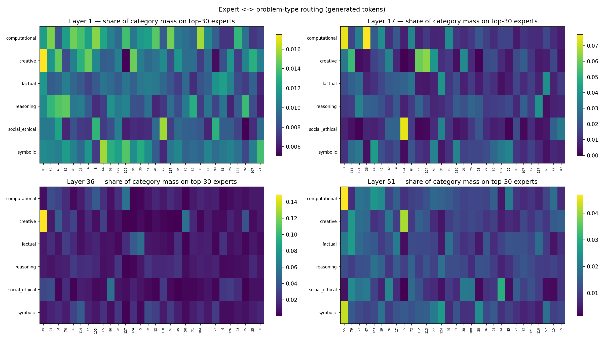
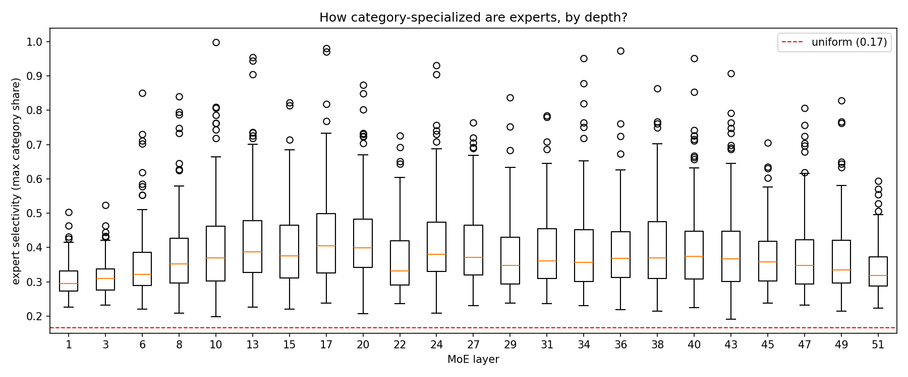
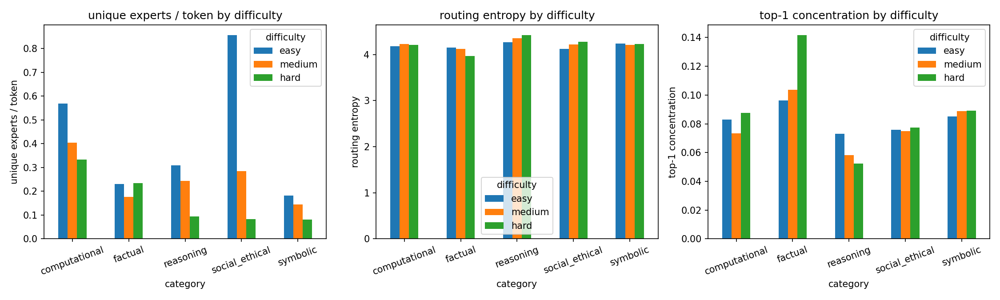
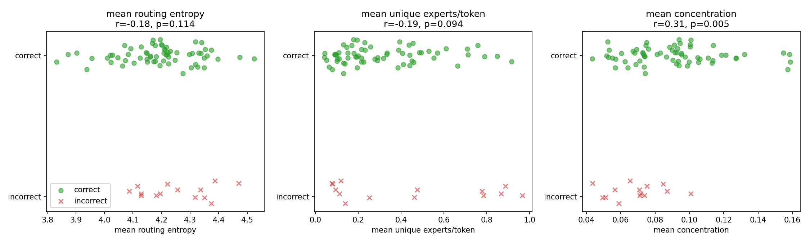
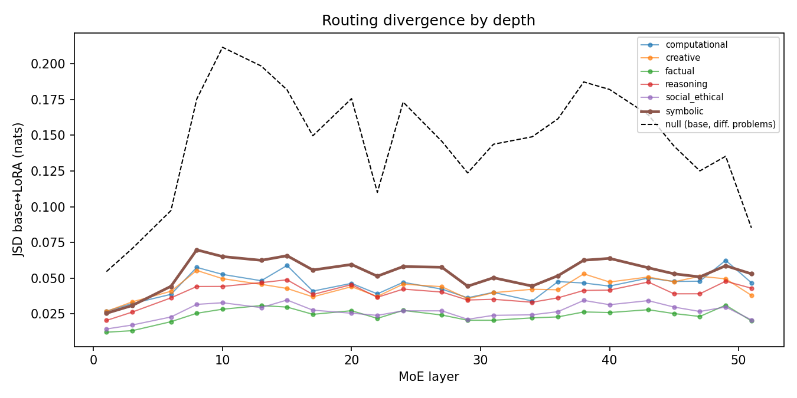
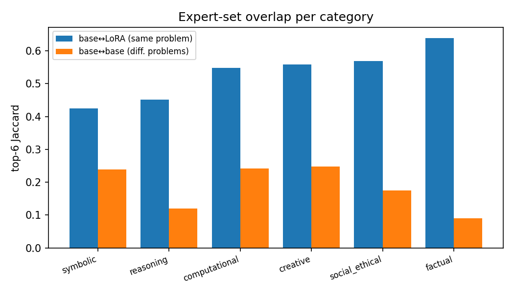
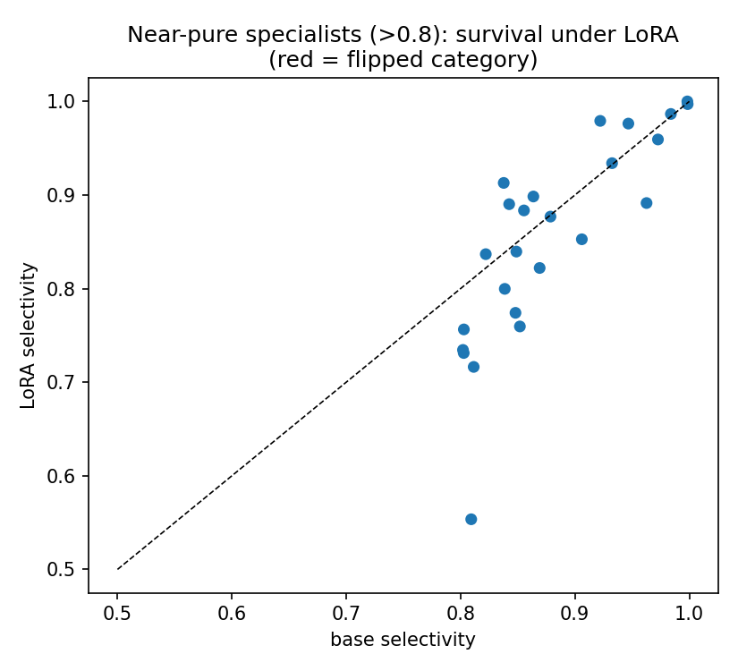
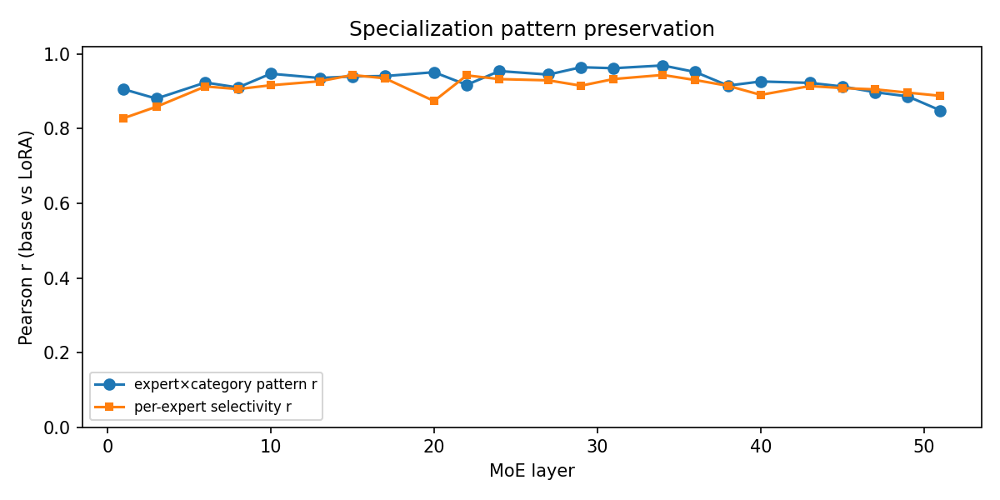

# Expert Routing Specialization in a Hybrid Mamba-MoE Model

**Phase 1: Base-Model Routing Analysis of Nemotron-3-Nano-30B-A3B**

*Status: DRAFT — Sections 4-6 pending Phase 1 run completion.*

---

## 1. Introduction

Mixture-of-Experts (MoE) layers replace a transformer's single feed-forward
network with a pool of smaller "expert" networks and a learned router that
sends each token to only a few of them. The model gets the capacity of the
full pool while paying the compute cost of the chosen few — Nemotron-3-Nano
carries 31.6B parameters but activates roughly 3B per token (hence "30B-A3B").

The router is where the interesting questions live. If routing were random,
an MoE would just be an awkward ensemble. The premise of the architecture is
that the router learns *useful structure*: experts come to serve particular
token distributions, and the router recognizes which tokens belong where.
What that structure looks like in a trained model is an empirical question:

- **Q1a** — Do experts specialize by problem *type* (factual recall vs.
  arithmetic vs. creative writing vs. moral reasoning)?
- **Q1b** — Does problem *difficulty* change routing (more experts? different
  experts? flatter or sharper routing distributions)?
- **Q1c** — Does routing behavior correlate with whether the model gets the
  answer *right* (is routing diversity a usable signal of confidence)?

Phase 2 (separate report section) compares this base-model picture against a
LoRA adapter fine-tuned exclusively on symbolic reasoning, asking whether
fine-tuning reshapes routing on its native domain and whether the reshaping
leaks into unrelated domains.

## 2. Background

### 2.1 The model

[Nemotron-3-Nano-30B-A3B](https://hf.co/nvidia/NVIDIA-Nemotron-3-Nano-30B-A3B-BF16)
is a *hybrid* architecture: of its 52 layers, only 6 are attention layers.
The rest alternate between Mamba-2 state-space layers (23) and MoE
feed-forward layers (23), in roughly 7-layer blocks
(Mamba → MoE → Mamba → MoE → Mamba → Attention → MoE):

| Type | Layer indices | Count |
|---|---|---|
| Mamba-2 SSM | 0,2,4,7,9,11,14,16,18,21,23,25,28,30,32,35,37,39,41,44,46,48,50 | 23 |
| MoE FFN | 1,3,6,8,10,13,15,17,20,22,24,27,29,31,34,36,38,40,43,45,47,49,51 | 23 |
| Attention | 5,12,19,26,33,42 | 6 |

Each MoE layer has **128 routed experts** plus one **shared expert** that
processes every token unconditionally. The shared expert gives the layer a
guaranteed common pathway; the routed experts are the specialization budget.

### 2.2 The router

Each MoE layer's router (`NemotronHTopkRouter`) is a DeepSeek-V3-style gate.
For each token it computes 128 scores via a linear map followed by a
**sigmoid** (not a softmax — scores are independent per expert), adds a
learned per-expert bias used only for selection (`e_score_correction_bias`,
a load-balancing device), picks the **top 6** experts, renormalizes their
scores to sum to 1, and scales by 2.5. The selected experts' outputs are
combined with these weights and added to the shared expert's output.

Two consequences matter for analysis. First, "how strongly a token wanted
expert e" is only observable for the 6 winners — the routing weights we log
are the renormalized winner scores. Second, because selection bias and score
are decoupled, an expert can be frequently *chosen* yet carry modest weight.

### 2.3 What we log

We hook every MoE layer's router and record, for every token at every layer,
the 6 winning expert indices and their weights — during both prompt
processing (prefill) and generation. Analysis defaults to generation-phase
tokens only: those reflect the model's own reasoning process rather than
prompt encoding, and in batched runs prefill rows include padding tokens.

### 2.4 Metrics

For a problem p and layer L, let m(e) be the total routing weight expert e
received over p's generated tokens, and P = m / Σm its normalization.

- **Unique experts**: |{e : m(e) > 0}| — coverage of the expert pool.
- **Entropy**: H(P) = −Σ P log P, in nats; range [0, log 128 ≈ 4.85].
  High = routing mass spread evenly; low = few experts dominate.
- **Concentration**: max(P) — share of the single most-used expert.
- **Selectivity** (per expert, per layer): across problem categories, the
  largest share of the expert's mass coming from a single category. 1.0 =
  exclusively serves one category; 1/6 ≈ 0.17 = perfectly uniform across our
  six categories.
- **Jaccard similarity** (Phase 2): |A∩B|/|A∪B| between top-expert sets.
- **Accuracy correlation**: point-biserial r between correctness and each
  routing metric, aggregated per problem across layers.

## 3. Methodology

### 3.1 Dataset

111 problems across six categories, each with graded difficulty
(`data/problems.json`, seed 42, every benchmark item fetched at build time):

| Category | n | Source | Difficulty axis |
|---|---|---|---|
| Factual | 24 | MMLU (global facts, geography, college bio/chem, professional medicine/law) | grade-school → professional |
| Computational | 24 | GSM8K (binned by solution step count) + generated arithmetic | 2-step → 5+-step |
| Reasoning | 18 | MATH-500 (binned by level) | level 1-2 → 4-5 |
| Creative | 12 | Generated templates | free-form → constrained forms |
| Social/ethical | 15 | Curated dilemmas | clear-cut → multi-stakeholder |
| Symbolic | 18 | Generated fresh, Wonderland-style | param ranges / base sizes |

The symbolic category mirrors the LoRA training domain (numeral systems,
unit conversion, ciphers, bit manipulation, operator transforms, base
conversion) but contains only newly generated, unseen items — it gives
Phase 2 its native-domain comparison set inside the same dataset.

Scoreable categories carry exact answers (computed or benchmark-provided);
creative and ambiguous social problems are unscored by design.

### 3.2 Inference protocol

Batched generation (batch 8, grouped by category so token budgets match),
temperature 0.6, top-p 0.95, seed fixed per batch, thinking mode enabled,
budgets 1024-3072 tokens by category. Answers extracted from `\boxed{}`,
scored by exact/numeric match (multiple choice: last standalone letter).
Generations that hit the token budget without emitting an answer are flagged
*truncated* and excluded from accuracy analysis (they are not model errors).
Hardware: 1× H100 80GB; model in BF16; transformers 4.57.3 pinned.

### 3.3 A necessary detour: repairing cached generation

This study's inference stack required fixing the model's shipped code. The
findings matter for anyone running Nemotron-3-Nano through Hugging Face
transformers, so we document them as a result in their own right.

**The model ships with cached generation broken end-to-end.** Five distinct
defects in `modeling_nemotron_h.py` interact so that `generate()` silently
runs without any cache:

1. `prepare_inputs_for_generation` returns the cache under the key
   `past_key_values`, but `forward()` only accepts it as `cache_params` —
   the cache is swallowed by `**kwargs` and dropped, every step.
2. Even when bridged, generate() round-trips the returned cache as
   `model_kwargs["cache_params"]`, which `prepare_inputs_for_generation`
   ignores — so a fresh, empty cache is constructed at every decode step.
3. The cache class (`HybridMambaAttentionDynamicCache`) lacks the
   `conv_kernel_size` attribute its own mixers read, and its
   `update_conv_state`/`update_ssm_state` methods call `.device` on a
   Python list — they crash on first genuine use.
4. The fused decode kernel is called with a transposed layout
   (`causal_conv1d_update` receives x as (B, 1, dim) instead of (B, dim, 1)).
5. Most consequentially: `NemotronHBlock.forward` never passes the cache to
   attention mixers at all. All six attention layers store no KV during
   prefill and attend to a *single token* during decode.

The failure mode of (5) is subtle and instructive: the model does not crash
or produce gibberish from step one. The Mamba conv states carry the last few
prompt tokens, so the model knows roughly *that* it was asked something and
can see the instruction suffix — it then confabulates the rest, producing
plausible-looking reasoning about a question it cannot see, decaying into
repetition loops. In a probe with a mid-prompt fact ("a parrot called
Marco") and an end-of-prompt question, the broken model guessed "Polly";
the patched model quotes the prompt verbatim and answers correctly.

Why was this never caught? Cacheless generation — the accidental default —
re-processes the full sequence every step, so attention layers *do* see
everything and outputs are coherent, just quadratically slow (~2 tok/s
observed, with O(t²) memory growth). Any test that tolerated the slowness
would pass. All five defects are patched at runtime in
`apply_nemotron_patches()` (scripts/capture_routing.py); no model files are
modified. Post-patch throughput: ~8-16 tok/s batched, coherent long-form
generation. The full debugging chronology, including dead ends, is in
RUNLOG.md (19 numbered errors).

### 3.3 Analysis pipeline

`scripts/analyze_routing.py` aggregates per-token logs into per-problem,
per-layer routing-mass vectors, then computes the metrics of §2.4. The
pipeline was validated end-to-end on synthetic logs with planted structure
(category-blocked experts, difficulty-controlled spread) and recovered all
planted effects before touching real data.

## 4. Results

Run summary: 111/111 problems completed; 95 scored, 82.3% correct after
excluding 16 budget-truncated generations (6 factual — mostly trivia the
model deliberates on at length, 4 social, 3 symbolic, 2 reasoning,
1 creative). Accuracy by category: computational 24/24, symbolic 15/15,
factual 88.9%, reasoning 56.3%. (Social/ethical scoring was unreliable —
those prompts lacked the boxed-answer instruction, so string matching
failed; treated as unscored.)

### 4.1 Expert specialization by problem type (Q1a)

**Routing is broad and diffuse at the corpus level.** A typical problem
touches 116 of 128 experts per layer over its generation; mean per-problem
routing entropy is 4.19 nats against a 4.85 maximum. There is no
block-structure of the kind a hard division of labor would produce.

**But specialization is real, soft in the bulk and sharp in the tails.**
Because categories contribute unequal token mass (symbolic 28%, creative
5%), raw category-share selectivity is misleading; we therefore normalize
each category's mass before computing an expert's selectivity (max share
across categories; uniform = 1/6 ≈ 0.167). Corrected median selectivity is
**0.32 — about twice the uniform baseline** — and follows an
**inverted-U over depth**: ~0.23 at layer 1, peaking ~0.37 around layers
17-20, declining to ~0.27 at layer 51. Early layers route generically,
mid-network layers differentiate by problem type, and the final layers
re-converge.

On top of this soft bulk sit **sparse, nearly pure specialists**: 26
expert-layer pairs exceed 0.8 selectivity. Examples: layer 10 expert 8
(100% factual), layer 17 expert 63 (99% creative), layer 17 expert 103
(99% social/ethical), layer 36 expert 67 (95% factual). These specialists
carry little total mass individually (~0.5-1% of a layer's routing) — they
are niche modules, not workhorses. Mid-network layers also have the most
moderately specialized experts (37 experts above 0.5 selectivity at layer
20 vs. 0 at layer 1).

**Key insight:** the router implements a two-tier economy — a large pool of
generalists handling most mass, plus a thin tier of near-pure category
specialists concentrated mid-network, where selectivity peaks.

### 4.2 Difficulty effects on routing (Q1b)

**Difficulty leaves routing distributions essentially unchanged.** Routing
entropy is flat across difficulty levels within every category (≈4.0-4.4
nats); top-1 concentration moves little, with one exception (hard factual
rises to 0.14 — driven by long, ruminative trivia deliberations
concentrating on few experts). The apparent decline of "unique experts per
token" with difficulty is a length artifact, as pre-registered: harder
problems generate longer chains of thought, and unique-expert counts
saturate near 128, so the ratio mechanically falls.

**Key insight:** the router responds to *what kind* of problem it is
processing, not to *how hard* the problem is; difficulty is essentially
invisible to routing once generation length is controlled for.

### 4.3 Routing and accuracy (Q1c)

**Concentrated routing predicts correctness.** Across scored problems,
per-problem mean top-1 concentration correlates positively with being
correct (point-biserial r = 0.31, p = 0.005); entropy and unique-expert
metrics correlate negatively but not significantly. Per the pre-registered
confound check, the correlation is not a difficulty artifact: it is
positive within every difficulty stratum (easy r = 0.28, medium r = 0.25,
hard r = 0.46, the last significant at p = 0.03) and within both scored
categories with enough variance (factual r = 0.33, reasoning r = 0.22).

**Key insight:** when the router "commits" — concentrating weight on fewer
experts — the model is more likely to be right; dispersed routing reads as
a weak uncertainty signal. Causality is open: confident routing may produce
correct answers, or familiar (well-learned) problems may produce both.

### 4.4 LoRA impact on routing (Q2a-Q2c)

Phase 2 ran the same 111 problems through the model with the
symbolic-reasoning LoRA (`brick-factorial/nemotron-lora-symbolic-reasoning`,
r=32) applied, capturing routing identically. A structural fact frames every
result in this section: **the adapter never touches the routing machinery.**
Its target modules are Mamba projections (`in_proj`, `out_proj`), attention
(`q/k/v/o_proj`), and the *shared* experts only — no routed expert and no
router gate receives a LoRA delta. All routing divergence below is therefore
*indirect*: the adapter changed the representations flowing into frozen
routers, and the routers changed their decisions in response.

Run summary: 111/111 problems captured (H100, same patched stack, same
seeds/budgets). Accuracy was stable outside the training domain
(computational 24/24, factual 18/24 vs. base 17/24, reasoning 9/18 = base)
but **dropped on the LoRA's native domain**: symbolic 11/13 vs. base 15/15
after excluding truncations, with truncations themselves rising 3 → 5 of 18
(the adapted model deliberates longer and overruns its budget more often).

**Q2a — native-domain shift: real, the largest of any category, yet small
in absolute terms.** Comparing each problem's per-layer routing-mass
distribution between models, symbolic problems show the highest divergence
(mean JSD 0.0537 nats, top-6 Jaccard 0.424) — significantly above all other
categories pooled (Mann-Whitney U = 1404, n = 18 vs. 93, one-sided
p < 10⁻⁵, rank-biserial r = 0.68) and above the nearest competitor,
computational (U = 297, p = 0.020). But scale matters: the *null* distance
between two different base-model symbolic problems is JSD 0.1096 — twice
the base→LoRA shift on the same problem. Fine-tuning re-weighted routing;
it did not re-route the domain. Concentration on symbolic problems rose
slightly (Δ +0.0023, concentrated in early-mid layers, e.g. +0.024 at
L15), directionally consistent with Phase 1's concentration↔competence
signal — though accuracy moved the other way (see A-caveat below).
Divergence peaks at layer 8 (JSD 0.070) and stays elevated through the
mid-network, near the specialization peak; layer 1 is almost untouched
(0.025).

**Q2b — cross-domain leakage: present, graded, bounded.** Divergence
ordering across categories: factual 0.0239 < social/ethical 0.0268 <
reasoning 0.0395 < creative 0.0434 < computational 0.0450 < symbolic
0.0537. Every category diverges far less than its own between-problem null
(factual: 9× less). The gradient tracks domain adjacency — computational
(digit-heavy) moves most among non-native categories, factual recall moves
least. LoRA's routing influence leaks, but proportionally to how much a
category shares surface/structural features with the training domain.

**Q2c — specialization architecture: preserved.** Per-layer
expert×category routing-mass patterns correlate at mean Pearson r = 0.927
between models (min 0.849, at the final layer 51). All 25 near-pure
specialists (selectivity > 0.8 under the divergence pipeline's
accounting) retain their category under LoRA — 0 flips — and the
specialist count is stable (25 → 26). Fine-tuning neither destroyed nor
re-assigned the specialist tier.

**Key insight:** a LoRA that never touches routers still steers them —
most strongly on its training domain, early-to-mid network, with leakage
graded by domain similarity — but the shift is a re-weighting *within* the
base model's routing geography (half the distance between two unrelated
problems), and the specialist economy survives intact.

## 5. Discussion

The interpretation guide below was written before analysis (pre-registered);
each question resolved as follows.

**On Q1a (specialization).** Both hypothesized positive patterns appeared
*simultaneously*: a soft, broadly shifted bulk (median selectivity ~2×
uniform) *and* sparse near-pure specialists. This is consistent with the
load-balancing pressure of DeepSeek-V3-style routing: the
`e_score_correction_bias` actively pushes against expert collapse, which
plausibly caps how specialized the bulk can become — yet a small tier of
niche specialists survives the pressure, suggesting their inputs are
distinctive enough that the balancing cost is worth paying. The inverted-U
depth profile mirrors a common interpretability finding: early layers
process surface features (generic), middle layers task structure (peak
differentiation), late layers output formatting (re-convergence). Caveat
held over from pre-registration: "category" selectivity may partly track
surface statistics (digits, verse line breaks) rather than semantics;
subtype-level analysis is future work.

**On Q1b (difficulty).** The pre-registered length confound materialized
exactly as feared — raw unique-expert ratios fall with difficulty purely
because hard problems generate longer outputs. The cleaner metrics (entropy,
concentration) are flat: difficulty is invisible to routing. The router is
a classifier of input kind, not an estimator of input hardness.

**On Q1c (accuracy).** The correlation survived its pre-registered
stratification test (positive in every difficulty stratum, strongest in
hard problems), so it is not a difficulty artifact. Routing concentration
is a weak but real correctness signal — potentially usable as a cheap
confidence proxy, since it requires no extra forward passes. The causal
direction remains open.

**Implications for Phase 2 (written before Phase 2; resolution below).**
With base-model specialization now mapped, the LoRA comparison gains
precision: we know symbolic problems already engage a distinct routing
profile, mid-network layers are where type-information lives (the natural
place to look for LoRA-induced shifts), and concentration correlates with
competence (so if the symbolic-trained LoRA *concentrates* routing on its
native domain, that would parallel the correctness signal).

**On Q2 (resolution).** The pre-registered expectations mostly held:
LoRA-induced shifts are largest on the native domain and the mid-network is
involved — though the divergence peak sits earlier (L8) than the
specialization peak (L17-20), suggesting the adapter's influence enters
through early representation shaping rather than the type-differentiated
core. The concentration prediction was directionally satisfied
(routing concentrated slightly on symbolic problems) but decoupled from
outcome: symbolic accuracy *fell*. This is a useful caution for Q1c's
interpretation — concentration tracks *familiarity/commitment*, not
competence per se; an overfit adapter can commit harder and be wrong more.
The deepest structural finding is the indirectness: with routers and routed
experts frozen, ~1 bit-scale changes in upstream representations were enough
to re-rank expert selections (top-6 Jaccard ≈ 0.42-0.64) while leaving the
expert-category map intact (r = 0.93). Routing in this architecture behaves
like a stable function over a *moving* representation space — Phase 3's
control-vector premise (steer routing via Mamba-layer interventions) is
plausible precisely because that is what the LoRA already did by accident.

## 6. Conclusion & Limitations

In Nemotron-3-Nano-30B-A3B, expert routing implements a two-tier division
of labor: a generalist bulk whose problem-type preferences are real but
soft (~2× uniform), and a thin tier of near-pure specialists concentrated
in mid-network layers where type-differentiation peaks. The router
distinguishes problem *kinds*, not problem *difficulty*, and the degree to
which it commits its weight to few experts carries a weak signal of whether
the model will answer correctly. Separately, this study required repairing
the model's shipped cached-generation path (§3.3) — five interacting
defects that silently degraded the model to prompt-amnesia; these repairs
are themselves a reusable contribution.

Known limitations:

- **Sample size**: 111 problems (~18-24/category) bounds the granularity of
  per-expert claims; per-expert-per-category estimates rest on few problems,
  so we emphasize layer-level and distribution-level statistics.
- **Single model, single scale**: findings describe Nemotron-3-Nano-30B-A3B,
  not MoE models in general; the hybrid Mamba backbone may make routing
  dynamics atypical relative to full-attention MoEs.
- **One sample per problem**: temperature 0.6 sampling with one generation
  per problem conflates sampling noise with routing signal; per-problem
  routing profiles average over hundreds of tokens, which mitigates but
  does not eliminate this.
- **Generated-phase only**: prefill routing is excluded by default (and in
  batched runs contains left-pad tokens). Conclusions are about routing
  *while generating*, not while reading.
- **Top-6 observability**: router scores are logged only for winners; we
  cannot see near-miss experts, so "routing distribution" means the
  renormalized winner distribution.
- **Truncations**: budget-capped generations are excluded from accuracy but
  their routing tokens are retained; ~severe truncation rates per category
  are reported alongside accuracy.
- **Patched inference stack**: all results depend on our runtime repairs to
  the model's cached-generation path (§3.3). The patches were validated
  behaviorally (verbatim mid-prompt recall, coherent long-form output), but
  an upstream-fixed reference implementation, when available, would be the
  cleaner baseline.

## Appendix

### A. Reproducibility
1. `python scripts/build_dataset.py` — rebuilds `data/problems.json`
   deterministically (seed 42; MMLU/GSM8K/MATH-500 fetched from the HF
   datasets-server; symbolic/creative/social generated).
2. `python scripts/capture_routing.py --model-path <M> --problems
   data/problems.json --out-dir outputs/logs/base --batch-size 8` — applies
   all runtime patches, runs instrumented inference, writes per-problem
   `routing_<pid>.npz` + `results.jsonl` + `run_config.json`.
3. `python scripts/analyze_routing.py --log-dir outputs/logs/base
   --problems data/problems.json --out-dir outputs/analysis/base` — all
   CSVs and figures.
- Environment pins: transformers==4.57.3, torch 2.8.0+cu128; install
  `causal-conv1d` and `mamba-ssm` with `--no-deps --no-build-isolation`
  (their resolver upgrades torch to an incompatible build otherwise), plus
  `einops`. Single H100 80GB suffices (~70GB peak).
- `scripts/probe_model.py`, `scripts/state_probe.py`,
  `scripts/debug_padding.py` — diagnostic tools used to locate the router
  gate and verify cache integrity.

### B. Error log
`RUNLOG.md` — chronological error/fix log (19 numbered errors), including
the full diagnosis narrative of the cached-generation repair.

### C. Full outputs
`outputs/analysis/` — per-problem metrics, per-expert specialization,
per-layer statistics, accuracy correlations, all figures.
